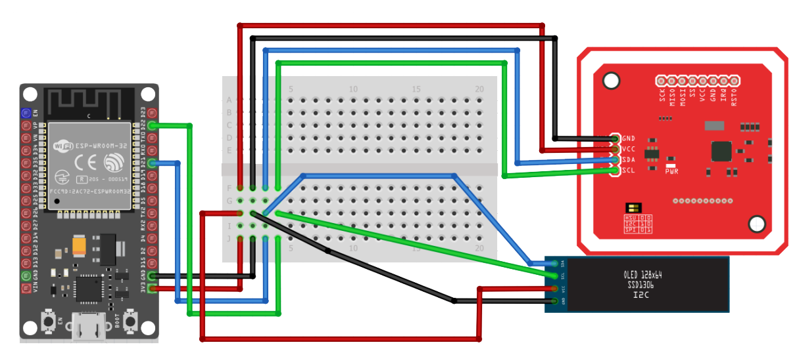

# Jag Pay Transit 🐯💳

## Problem statement

The Higher Technological Institute of Ciudad Hidalgo offers the service of public transportation along the 18 de Marzo route, which is commonly used by the majority of students to reach the institute's facilities.

As the primary transportation route for most students, it faces some inconveniences, such as the payment system. This route continues to charge its service in the traditional way, requiring cash payment. Over the years, this has presented several issues.

One of the main problems is that students often do not pay with the exact amount, and they sometimes use high-denomination bills. This can result in the first passengers receiving change for their fare, but as more students or people unrelated to the institution use the route, the combi (shared van) may run out of sufficient change to return to the majority of passengers. This creates a bottleneck in paying for transportation, leading to a loss of time in reaching the school on time.

Another issue arises from the perspective of the combi drivers, who encourage everyone using the route to pay their fare upon boarding to maintain better control during fare collection. In many instances, students and external individuals using the route pay their fare only when they are about to exit the combi. This lack of synchronization creates a challenge for the drivers as they need to focus on driving safely with passengers on board. Often, they forget who paid upon boarding or who is yet to pay upon exiting. This reliance on passengers to pay results in some individuals taking advantage of the situation, avoiding payment and causing financial losses for both the drivers and the route in general.

&nbsp; 
&nbsp; 

  
  
  
  
  
  
  
  
  

## Goal 
Develop a payment system with RFID cards using PHP for the server and Kotlin for the mobile application.

  

## Features

* Use a rfid card to pay for the service in a sensor located in each combi
* User authentication
* Show payment history

&nbsp; 
&nbsp;

## Design 

  

## REST API, database and Arduino code
[RFID API ](https://github.com/JoseCorreaMorales/rfidAPI)

## Technologies/Tools Used
* Kotlin
* Android Studio
* Volley for HTTP requests
* PHP REST API
* ESP32
* MySQL
* RFID cards
* RFID sensors
* Arduino

## Circuit Diagram

Connection diagram of the ESP32 with the RFID reader and the screen where various messages will be displayed every time an action is performed with the reader.

  

## Installation
* Configure the base API URL in Config.kt.
* Compile and install the app on an Android device.
* Usage
* Register and log in.
* Check the list of registered transactions.

## Requirements
* Android 5.0 or higher
